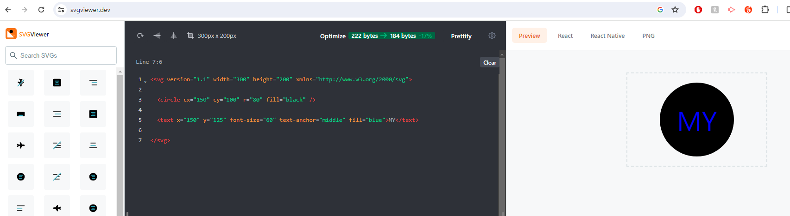

# SVG Logo Generator

## Description

This is a command-line application that dynamically generates a professional SVG file for a user's input using the Inquirer package.  

## Installation

The user will need to install the inquirer package in order to use this application. Please use "npm i inquirer@8.2.4". 

In order to run a unit test for this application, please install the jest package. 

## Usage

To use the SVG Logo Generator Application, you will need to clone this GitHub repo to your local machine and open it in VS Code. 

You will then need to open the terminal in VS Code. To do that, simply click on "View", and then click on "Terminal". Once in the terminal, you should already be inside the application folder. If not, please follow the below instructions. 

In the terminal, go into the folder that you are currently in. To do that, type "cd " and then the location of the folder. For example, if the application folder is inside the "Documents" folder, simply type in "cd Documents" and then "cd SVG-Logo-Generator". 

Once in the correct folder, enter "node index.js". This will initiate the questions prompts for you to enter all the details required for your professional SVG logo file. 

Once you have answered all the required prompts, you will see a message that logs "Your SVG logo has been created!", and a new file called "logo.svg" will appear inside the folder. 

To view your SVG file, simply open a browser and head to "https://www.svgviewer.dev/" and copy+paste the code generated from your new "logo.svg" file into the SVG viewer command line. 

Below is a screenshot of what you should see in SVG Viewer:

Below is a link to a walkthrough video to assist with how to use the application:
[Click here for the walkthrough video](https://drive.google.com/file/d/1C88JpOz78GJ_r7KpxK9IeeQvKA_HR9Ci/view)

## Credits

Coding Bootcamp by USYD x EDX

## License

Please refer to the LICENSE in the repo.

## Contacts

* GitHub: https://github.com/miloyang
* Email: miloyang9@gmail.com
